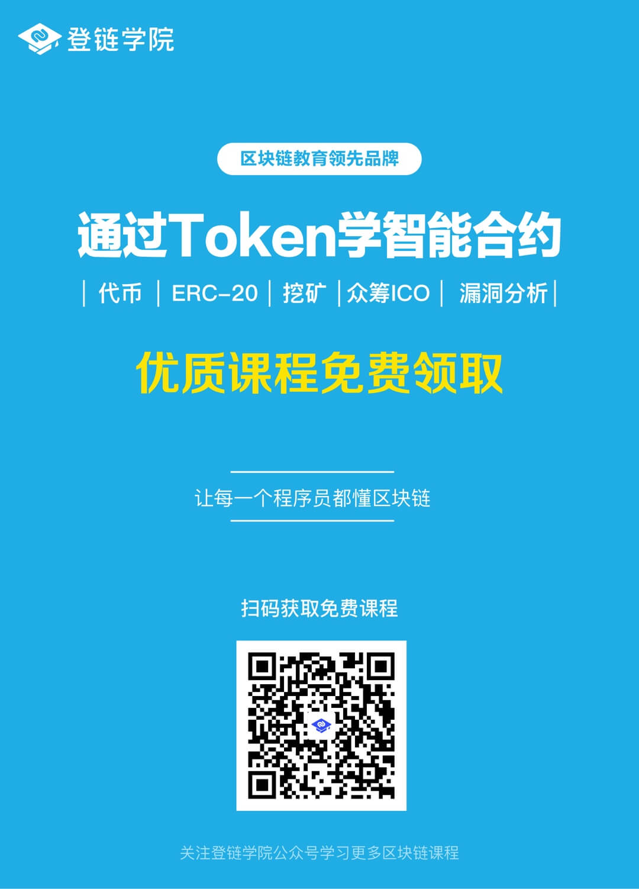

## 通过代币学以太坊智能合约开发视频

本课程是发币必看，众筹（ICO）必看，通过本课程不仅仅学习到如何发行一个代币（Token 或通证），以及如何进行众筹。

授人予鱼不如授人予渔，本视频通过代币及众筹的编写，学习理解更多Solidity语言的特性，让大家可以触类傍通开发更多功能的智能合约。

另外一点，课程的代码也提供给大家了，[github地址](https://github.com/xilibi2003/learnSmartContractByToken)，你可以直接使用这套代码发行自己的代币。

不过大家最好还是在观看视频之后，理解之后在使用代码。

视频由深入浅出区块链博主，以太坊基金会讲师 Tiny熊讲解。

PC端用户可直接前往[51CTO学院](http://edu.51cto.com/course/14173.html)学习，5星评价还可以登链小哥哥（微信号： **upchainedu**）还有**红包**相送哦。

扫码关注登链学院公众号，回复“ERC20”，获取免费课程。

## 视频完整大纲

### 1. 智能合约与Token代币介绍
理解什么是以太坊智能合约，以及如何用代币智能合约

### 2. 实现简单代币Token
Remix简单介绍；学习编写简单的合约；solidity mapping的使用

### 3. ERC20 标准代币介绍
学习ERC20 标准协议， 以及合约接口定义

### 4. ERC20 标准代币实现

学习合约的继承，事件定义，触发事件。

### 5. ERC20 代币部署、转账及代码验证

学习使用Remix + MetaMask 把合约部署到以太坊网络；
学习在以太坊网络查询合约信息；
学习提交代码验证。

### 6. 实现代币管理者
学习函数修饰器的用法(定义修饰器及使用修饰器)。

### 7. 实现代币增发功能（挖矿）
学习合约的多重继承 以及 如何调用父合约构造方法。

### 8 实现资产冻结功能
学习使用函数重载， 重载transfer 及 transferFrom函数 添加冻结功能。

### 9. 实现代币销毁
梳理代币销毁逻辑及实现

### 10. 代币高级功能总结及众筹介绍
代币高级功能总结，介绍锁定（或逐步释放）等高级功能。
介绍实现众筹合约的要素

### 11. 实现代币众筹（ICO）
学习使用回退函数（Fallback）及 payable 使用来实现众筹合约

### 12. 实现代币众筹（ICO）
学习使用回退函数（Fallback）及 payable 使用来实现众筹合约

#### 13. 部署及演示如何参与众筹及空投、阶梯定价
部署及演示如何参与众筹及扩展的空投、阶梯定价实现介绍
