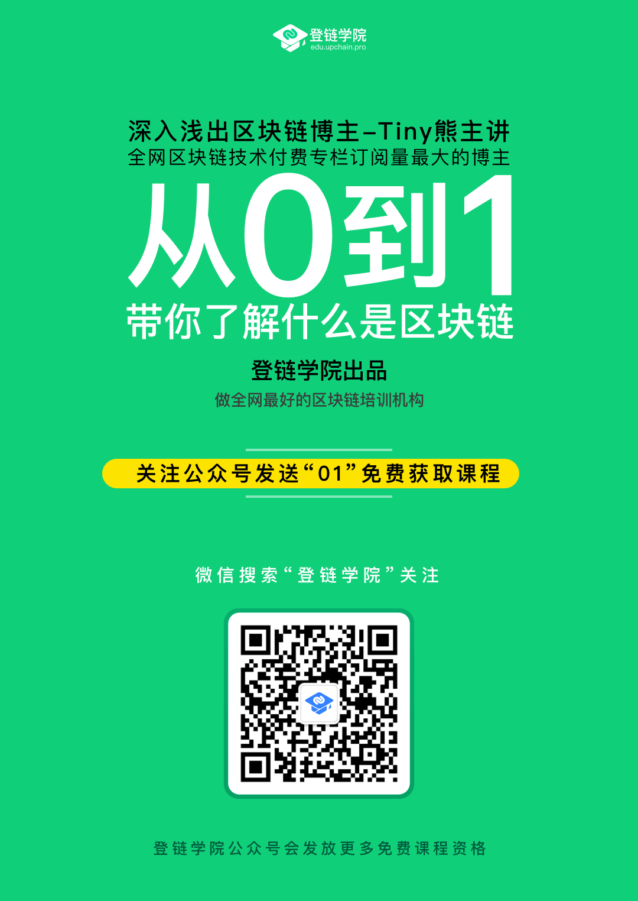

## [视频课程]区块链入门-零基础搞懂区块链

本课程是零基础入门课，适合所有想进入区块链世界的开发人员及学生群体。
区块链是每个人都应该了解的技术趋势，也是难得的技术浪潮机会。

课程由登链科技CTO、以太坊基金会讲师熊丽兵（本站站长Tiny熊）主讲。

通过本门课程可以学习到：
1. 区块链价值有哪些，为什么说它是一个**价值互联网**。
2. 区块链是**如何解决信任问题**，它将如何改变人跟人、商业与社会的协作方式。
3. 区块链应用场景有哪些
4. 区块链从何而来，比特币是怎么横空出世的。
5. 了解区块链鼻祖比特币到底什么，和现在的货币有什么不同。
6. 区块链原理讲解：区块链结构、工作量证明（POW）等等
7. 以太坊是什么，何为智能合约？
8. EOS是什么，什么是DPOS？

注：需要进登链学院区块链技术交流群的朋友，请加登链课程助理（微信：**upchainedu**），想挑战自己的还可申请成为[课程体验师](https://learnblockchain.cn/course/#%E6%8B%9B%E5%8B%9F%E8%AF%BE%E7%A8%8B%E4%BD%93%E9%AA%8C%E5%B8%88)。

## [如何获取视频](http://edu.51cto.com/course/14291.html)

PC端用户可直接前往课程视频地址[http://edu.51cto.com/course/14291.html](http://edu.51cto.com/course/14291.html)学习。

手机用户可扫码关注登链学院公众号，回复“**01**”，获取课程。

