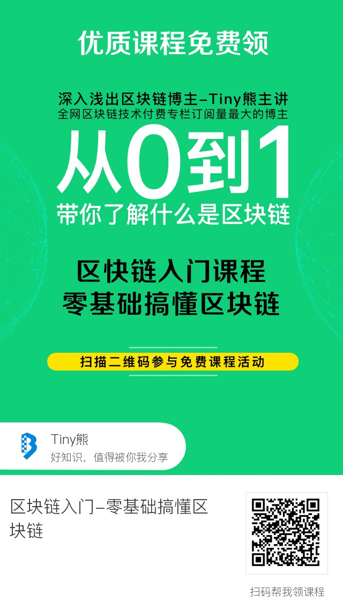

## [视频教程]区块链入门-零基础搞懂区块链

本课程由登链科技CTO、以太坊基金会讲师、[深入浅出区块链](https://learnblockchain.cn)博主 熊丽兵（Tiny熊）主讲，由最受好评的登链学院（公众号同名）出品。

## 适合人群
本课程是零基础入门课，适合所有想进入区块链世界的开发人员及学生群体。

如果你对智能合约开发感兴趣，可以进一步学习[深入详解以太坊智能合约语言Solidity](https://wiki.learnblockchain.cn/course/solidity.html)及[通过代币学以太坊智能合约开发](https://wiki.learnblockchain.cn/course/token.html)

## 课程介绍
区块链是每个人都应该了解的技术趋势，也是难得的技术浪潮机会。

通过本门课程可以学习到：
1. 区块链价值有哪些，为什么说它是一个**价值互联网**。
2. 区块链是**如何解决信任问题**，它将如何改变人跟人、商业与社会的协作方式。
3. 区块链应用场景有哪些
4. 区块链从何而来，比特币是怎么横空出世的。
5. 了解区块链鼻祖比特币到底什么，和现在的货币有什么不同。
6. 区块链原理讲解：区块链结构、工作量证明（POW）等等
7. 以太坊是什么，何为智能合约？
8. EOS是什么，什么是DPOS？

需要进登链学院区块链技术交流群的朋友可加登链课程助理晓娜微信：upchainedu

**登链学院让每个程序员都懂区块链**

## 三种方式获取视频课程的，总有一种适合你
### 方式1：申请成为课程体验师
 需要你能跟上我们的学习节奏（有学习任务），提出有益的问题。登链的所有课程可免费学，申请请加登链课程助理晓娜微信：**upchainedu**，详情见[申请成为课程体验师](https://learnblockchain.cn/course/#%E6%8B%9B%E5%8B%9F%E8%AF%BE%E7%A8%8B%E4%BD%93%E9%AA%8C%E5%B8%88)。

###  方式2：通过分享免费获取

欢迎关注“登链学院”公众号，回复“01”获取课程， 可以直接扫码：

### 方式3：土豪直接购买
不方便转发的同学，可直接付费听课，请点击[视频课程地址](https://m.qlchat.com/wechat/page/channel-intro?channelId=2000001601936397)，扫码登录购买即可观看。

