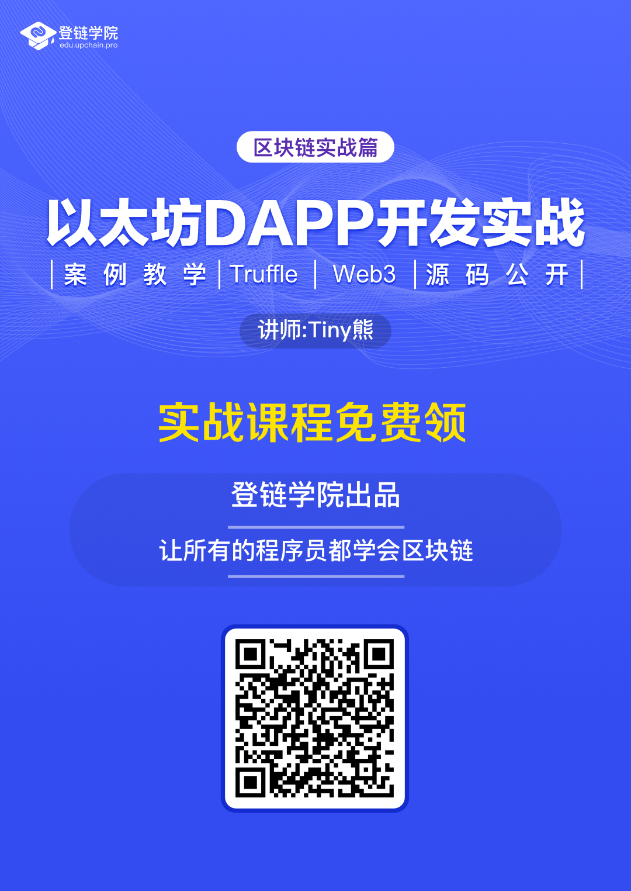

## [视频教程]区块链全栈-以太坊DAPP开发实战

课程由登链科技CTO、以太坊基金会讲师、[深入浅出区块链](https://learnblockchain.cn)博主 熊丽兵（Tiny熊）主讲，由最受好评的登链学院（公众号同名）出品。

## 适合人群

面向（准备）从事区块链应用开发工作的工程师及学生，要求：
1. 对区块链、以太坊、有基本了解
2. 了解智能合约开发、Solidity语言

学习本课程如果对区块链（尤其是以太坊）及Solidity编程有简单的了解会更容易理解本课程的内容。如果没有了解，可以先跟随[博客指引](https://learnblockchain.cn/2018/01/11/guide/)学习或学习视频[入门课程](https://wiki.learnblockchain.cn/course/beginner.html)及[深入详解Solidity语言](https://wiki.learnblockchain.cn/course/solidity.html)

## 课程介绍

本门课从一个去中心化的概念讲起，让大家理解去中心化应用与传统应用的不同，以及开发一个完整去中心化应用需要掌握哪些知识，然后用一个个案例逐步深入介绍每一个知识点。

第一个案例是一个最简单的DApp，它是使用最原始的方式构建出来(没有使用任何框架)，
通过这个实战为例，我们可以最根本理解如何编写智能合约，应用UI界面以及它们之间如何进行交互。

在理解DApp本质之后，逐步通过案例深入介绍知识点并引入各个工具提高开发效率。

课程的知识点包括：

需要进登链学院区块链技术交流群的朋友可加登链课程助理晓娜微信：upchainedu

**登链学院让每个程序员都懂区块链**

## 三种方式获取视频课程的，总有一种适合你

### 方式1：申请成为课程体验师
 需要你能跟上我们的学习节奏（有学习任务），提出有益的问题。登链的所有课程可免费学，申请请加登链课程助理（微信：**upchainedu**），详情见[申请成为课程体验师](https://learnblockchain.cn/course/#%E6%8B%9B%E5%8B%9F%E8%AF%BE%E7%A8%8B%E4%BD%93%E9%AA%8C%E5%B8%88)。

###  方式2：通过分享免费获取

欢迎关注“登链学院”公众号，回复“DAPP”获取课程， 也可以直接扫码：

### 方式3：土豪直接购买
不方便转发的同学，可直接付费听课，请点击[视频课程地址](https://m.qlchat.com/wechat/page/channel-intro?channelId=2000001891847934)，扫码登录购买即可观看。
