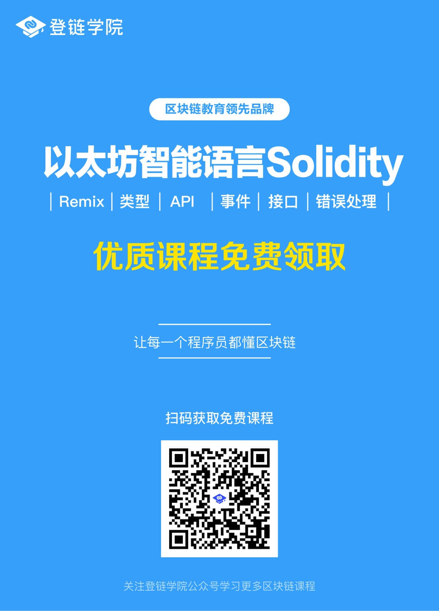

## [视频教程]深入详解以太坊智能合约语言Solidity

课程由登链科技CTO、以太坊基金会讲师、[深入浅出区块链](https://learnblockchain.cn)博主 熊丽兵（Tiny熊）主讲，，由最受好评的登链学院（公众号同名）出品。

## 适合人群
最好对区块链有简单的了解，没有了解可以先跟随[博客指引](https://learnblockchain.cn/2018/01/11/guide/)学习或学习视频[入门课程](https://wiki.learnblockchain.cn/course/beginner.html)
最好有一些其他编程语言的编写经验
当然最重要的是 想要学习智能合约的开发

## 课程介绍

目前市面上最全面深入介绍Solidity的课程，内容包括但不限于：
* 以太坊核心概念…
* 语言类型：基本类型、结构体、映射…
* 函数、修饰器、API 、事件、错误处理…
* 继承、库、重载…
* MetaMask， Remix 的高级用法…
* 如何调试合约
* 各种工具库的使用…

课程代码库为：[https://github.com/xilibi2003/leanSolidity](https://github.com/xilibi2003/leanSolidity)

如果你能全面掌握并数量运用课程内容，可胜任任何公司的智能合约岗位。

需要进登链学院区块链技术交流群的朋友可加登链课程助理晓娜微信：upchainedu

**登链学院让每个程序员都懂区块链**

## 三种方式获取视频课程的，总有一种适合你

### 方式1：申请成为课程体验师

 需要你能跟上我们的学习节奏（有学习任务），提出有益的问题。登链的所有课程可免费学，申请请加登链课程助理（微信：**upchainedu**），详情见[申请成为课程体验师](https://learnblockchain.cn/course/#%E6%8B%9B%E5%8B%9F%E8%AF%BE%E7%A8%8B%E4%BD%93%E9%AA%8C%E5%B8%88)。

###  方式2：通过分享免费获取

欢迎关注“登链学院”公众号，回复“solidity”获取课程，可以直接扫码：

### 方式3：土豪直接购买
不方便转发的同学，可直接付费听课，请点击[视频课程地址](https://ke.qq.com/course/326528?tuin=bd898bbf)，扫码登录购买即可观看。
